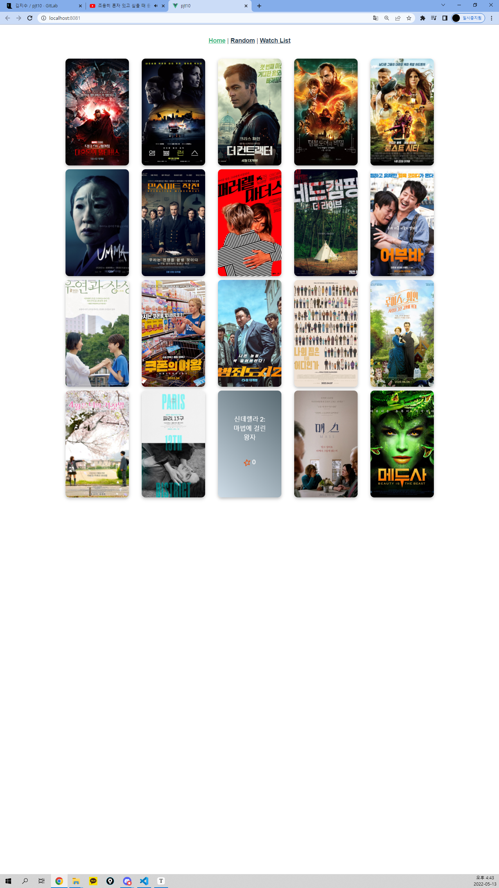
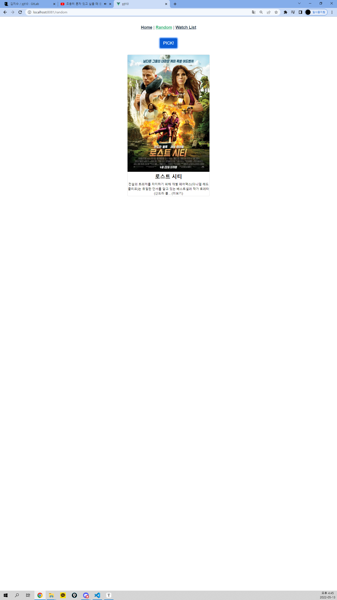
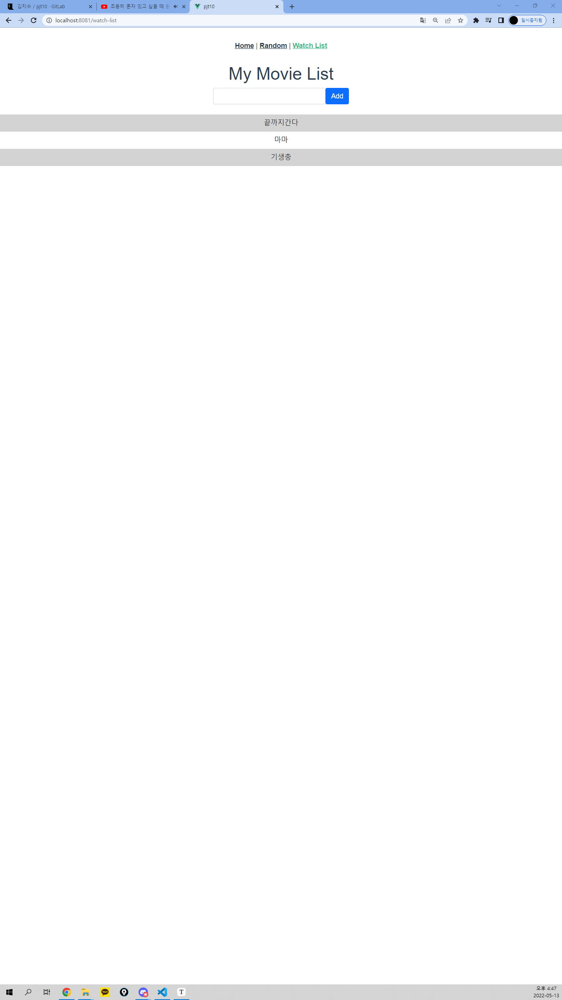

1. router

 ```
 const routes = [
   {
     path: '/',
     name: 'home',
     component: HomeView
   },
   {
     path: '/random',
     name: 'random',
     component: RandomView
   },
   {
     path: '/watch-list',
     name: 'watchList',
     component: WatchListView
   }
 ]
 ```

2. components 구성

```
App.vue 
(1) Home -> Movie card
(2) Random 
(3) WatchList -> Form, ListItem
```


3. MovieCare.vue

   UX 향상을 위해 포스터에 마우스 오버효과를 주어 마우스를 올리면 카드가 회전하며 

   포스터 뒷면에서 영화제목과, 별점을 확인 할 수 있음 => 향후 포스터 뒷면 클릭시 TMDB 상세페이지로 넘어갈 수 있도록 하면 어떨까? 

   


4. RandomView.vue

   버튼을 누르면 최신영화15개중 랜덤추천 가능하도록 TMDB API요청

   


5. WatchListView.vue

   components로 WatchListForm, WatchListItem을 가지고 있음

   사용자가 입력하면 listItem에서 출력하여 보여줌 => 삭제나, 수정은 넣지 않았기때문에 향후 최종프로젝트에 구현하면 좋을 것 같음. 

   
